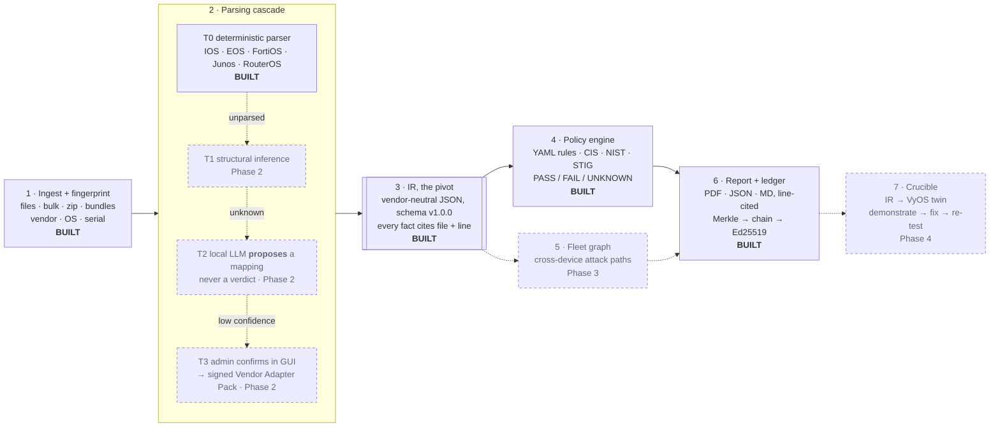

# Crucible: architecture

**Compliance you can prove.** Smart India Hackathon 2026 · SIH26155 · NTRO · Blockchain & Cybersecurity

> The two-page PDF version of this document is [Crucible-Architecture.pdf](Crucible-Architecture.pdf).
> Both are kept in step. The full design is in [docs/02–11](../00-index.md) and [docs/adr](../adr/).

**The problem.** A single government network runs firewalls, routers and switches from dozens of
vendors, and every device must comply with CIS, NIST SP 800-53, DISA STIG and ISO/IEC 27001.
Auditors either work a three-hundred-item checklist by hand or buy a suite locked to one vendor.
NTRO asked for a vendor-agnostic engine that an administrator can teach new vendors *without
redeploying code*. For a customer like NCIIPC it must also never send a configuration off the
machine.

**The pivot.** Everything turns on one **vendor-neutral intermediate representation** (IR), an LLVM
IR for network security posture. Parsers write into it. Rules, reports, remediation, graph analysis
and the verification sandbox read *only* from it. Adding a vendor never touches a rule; adding a
framework never touches a parser. That one property satisfies the *no manual code modification*
requirement, and an import-contract check enforces it.

## 01 · Pipeline



*Solid = built and tested today · dashed = specified, with its phase. Nothing below stage 3 ever
reads raw configuration text.*

## 02 · The five invariants: guarantees, each enforced by tests

| # | Invariant | Consequence |
|---|-----------|-------------|
| 1 | **The AI never decides pass or fail.** It only writes parsers. | Model output is a candidate extraction rule, applied deterministically; the verdict comes from the YAML engine. *The AI proposes, the engine decides.* |
| 2 | **Every finding carries line-level evidence.** | File, line number and raw text. The IR builder refuses a fact without a source line. |
| 3 | **Fail closed.** Unparsed input can never produce a pass. | A missing fact evaluates to UNKNOWN under Kleene three-valued logic, and UNKNOWN can never become PASS. |
| 4 | **Coverage is published, not hidden.** | Every report states `parsed 163 of 164 lines (99.4%)` and lists each uninterpreted line verbatim. `parsed + unparsed == total` is asserted. |
| 5 | **Three honest states, never two.** | `DEMONSTRATED` (proven on a twin) · `ASSERTED` (rule matched) · `UNKNOWN` (could not determine). |

## 03 · Why an IR, and not a prompt

The obvious approach pastes a whole config into an LLM and asks for a verdict. That fails every
property an audit needs: it is not reproducible, it cannot cite a line, it fails open when it
misreads, and it sends the network's blueprint to someone else's server. With an IR, the model's job
shrinks to proposing how to *read* a line nobody recognised, and that proposal is checked and
applied deterministically. Because context limits only ever apply to single unresolved lines, a
40,000-line config costs nothing extra.

## 04 · Air-gapped by construction

A device configuration maps every ACL, trust relationship and credential hash. For NCIIPC, a cloud
LLM API is a hard disqualifier, whatever the preference. The system makes **zero outbound calls**. The
console ships no web fonts or CDN assets, and a test fails the build if any asset reaches off the
host. The planned AI tiers run a local quantised model via Ollama with local embeddings
([ADR 0003](../adr/0003-local-models-only.md)). The current build needs no model at all.

## 05 · Mapping to the five NTRO components

| Component | Where it lives | What it does | Status |
|-----------|----------------|--------------|--------|
| 1 Unified ingestion | `ingest/` `fingerprint/`, console, `POST /audit` | Single or bulk upload, directories, zip archives and device bundles (config plus `show version` read as one device). Refuses path traversal, symlinks and zip bombs. Weighted fingerprinting of six vendors with a published confidence. | **Built** |
| 2 AI training module | `training/` `adapters/`, Next.js GUI | Tiers 1–3: infer structure, a local model proposes a field mapping, and the admin confirms in a low-code GUI. The result is exported as a **signed, portable Vendor Adapter Pack**. Every uninterpreted line is already surfaced verbatim today; that list is the GUI's input. | Phase 2 |
| 3 Multi-framework engine | `policy/` `rules/*.yaml` | A control is data. Each of the 13 controls maps to CIS v8, NIST SP 800-53 and a DISA STIG ID, and `--framework` selects without re-parsing. ISO 27001 rules and an XCCDF importer come next. | **CIS · NIST · STIG** |
| 4 Reporting & PDF | `report/` `ledger/` | A per-device PDF with identity (vendor, model, OS, **serial**), pass/fail by severity, line-cited evidence, vendor-specific remediation CLI, a what-if score, a coverage appendix, and a verification hash on every page. | **Built** |
| 5 Vendor-agnostic scale | `schemas/ir`, parser registry | A frozen, versioned IR schema. New rules and frameworks need no code. A new vendor is one Tier-0 module today, and an imported adapter pack with no code once Phase 2 lands. | Foundation |

## 06 · Parsing cascade: the AI proposes, the engine decides

**Tier 0**: deterministic parsers record provenance for every fact and account for every line.
Unclaimed lines fall to **Tier 1**, which detects the grammar (brace, indent, flat) and builds a
generic tree. Unknown nodes reach **Tier 2**, where a local model proposes a mapping such as
`set admintimeout 10` → `mgmt.idle_timeout_min`. The mapping is applied as a deterministic rule,
*never* as a judgement. At low confidence, **Tier 3** asks an administrator and signs the confirmed
mapping into an adapter pack, so the next run handles that line at Tier 0. A low-confidence
fingerprint runs no parser at all: an unknown device reports UNKNOWN instead of being misread.

## 07 · Remediation that cannot lock you out

Fixes are ordered by safety, not severity: **0** establish the safe path (enable SSH) → **1** harden →
**2** disable weak services (Telnet off) → **3** restrict management access. Pasted top to bottom, the
administrator is never cut off.

## 08 · Tamper-evident reports: the blockchain half, done honestly

```
finding + evidence ─► SHA-256 leaf (domain-separated)
per-report Merkle tree ─► merkle_root
ledger entry {seq, time, report_id, merkle_root, prev_entry_hash} ─► Ed25519 signature
PDF footer ─► report id · ledger seq · verification hash
```

Change one character of a past entry and its signature fails and the next link breaks. Hiding
that means re-signing every later entry, which needs the issuing private key.
`crucible verify` checks the chain and signatures offline, with only the ledger and the public key.
There is one writer and no mutually distrusting peers, so a consensus blockchain would add
operational weight and no integrity ([ADR 0006](../adr/0006-no-permissioned-blockchain.md)).

## 09 · Technology

**Today:** Python 3.11, PyYAML, ReportLab, cryptography, FastAPI; a plain HTML/JS console. One
process, no database, no container. **Planned:** Ollama (local LLM), local embeddings, Next.js
training GUI, NetworkX/Batfish, containerlab + VyOS.

## 10 · Measured on the current build

| 101 | ≈ 1 s | 99.6% | 13 × 3 |
|:---:|:---:|:---:|:---:|
| tests passing | 5 vendors audited, offline | mean line coverage | controls × frameworks |

No accuracy figure is claimed yet. Precision and recall on a hand-labelled corpus are Phase 3
([docs/16](../16-validation-plan.md)).

| Phase 0 · done | Phase 1 · done | Phase 2 · next | Phase 3 | Phase 4 |
|---|---|---|---|---|
| IR schema and rule format frozen, specs, ADRs | config in → line-cited, signed PDF out | training loop, adapter packs, XCCDF, ISO | fleet graph, attack-path ranking, accuracy | Crucible: prove the finding and the fix on a twin |
