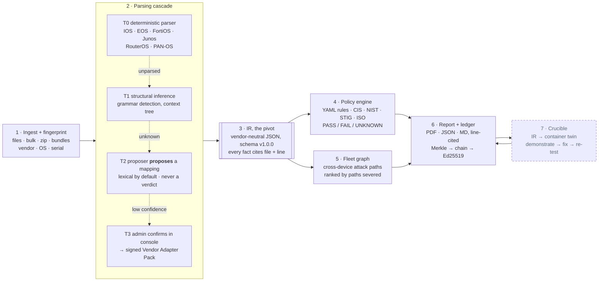

# Crucible: architecture

**Compliance you can prove.** Smart India Hackathon 2026 · SIH26155 · NTRO · Blockchain & Cybersecurity

> The two-page PDF version of this document is [Crucible-Architecture.pdf](Crucible-Architecture.pdf).
> Both are kept in step. The full design is in [docs/02–11](../00-index.md) and [docs/adr](../adr/).

**The problem.** A single government network runs firewalls, routers and switches from dozens of
vendors, and every device must comply with CIS, NIST SP 800-53, DISA STIG and ISO/IEC 27001.
Auditors either work a three-hundred-item checklist by hand or buy a suite locked to one vendor.
NTRO asked for a vendor-agnostic engine that an administrator can teach new vendors *without
redeploying code*. For a customer like NCIIPC it must also never send a configuration off the
machine.

**The pivot.** Everything turns on one **vendor-neutral intermediate representation** (IR), an LLVM
IR for network security posture. Parsers write into it. Rules, reports, remediation, graph analysis
and the verification sandbox read *only* from it. Adding a vendor never touches a rule; adding a
framework never touches a parser. That one property satisfies the *no manual code modification*
requirement, and an import-contract check enforces it.

## 01 · Pipeline



*Every stage is built and tested. Dashed = needs a Docker daemon; without one, findings stay
ASSERTED and the audit is unaffected. Nothing below stage 3 ever reads raw configuration text.*

## 02 · The five invariants: guarantees, each enforced by tests

| # | Invariant | Consequence |
|---|-----------|-------------|
| 1 | **The AI never decides pass or fail.** It only writes parsers. | A proposal is a candidate extraction rule, applied deterministically; the verdict comes from the YAML engine. A model is asked only to *choose* among candidates and point at the value token — never to write a pattern, so it cannot smuggle a regex into a pack. |
| 2 | **Every finding carries line-level evidence.** | File, line number and raw text. The IR builder refuses a fact without a source line. |
| 3 | **Fail closed.** Unparsed input can never produce a pass. | A missing fact evaluates to UNKNOWN under Kleene three-valued logic, and UNKNOWN can never become PASS. |
| 4 | **Coverage is published, not hidden.** | Every report states `parsed 163 of 164 lines (99.4%)` and lists each uninterpreted line verbatim. `parsed + unparsed == total` is asserted. |
| 5 | **Three honest states, never two.** | `DEMONSTRATED` (proven on a twin) · `ASSERTED` (rule matched) · `UNKNOWN` (could not determine). |

## 03 · Why an IR, and not a prompt

The obvious approach pastes a whole config into an LLM and asks for a verdict. That fails every
property an audit needs: it is not reproducible, it cannot cite a line, it fails open when it
misreads, and it sends the network's blueprint to someone else's server. With an IR, the model's job
shrinks to proposing how to *read* a line nobody recognised, and that proposal is checked and
applied deterministically. Because context limits only ever apply to single unresolved lines, a
40,000-line config costs nothing extra.

## 04 · Air-gapped by construction

A device configuration maps every ACL, trust relationship and credential hash. For NCIIPC, a cloud
LLM API is a hard disqualifier, whatever the preference. The system makes **zero outbound calls**,
and there is no cloud SDK in the dependency tree. The console ships no web fonts or CDN assets, and
a test fails the build if any asset reaches off the host. Tier 2 runs a deterministic proposer
that needs no model at all, and optionally **Qwen2.5-Coder-7B served by Ollama on loopback** —
where the transport itself, not merely the URL, refuses any other address, so a proxy configured
in the environment cannot capture a prompt ([ADR 0003](../adr/0003-local-models-only.md)). The
model is opt-in: one merely listening on loopback is never adopted, because an audit must give
the same answer twice. The offline bundle is verified by installing it with no package index and
no usable proxy, then running the suite and a full audit from the installed copy.

## 05 · Mapping to the five NTRO components

| Component | Where it lives | What it does | Status |
|-----------|----------------|--------------|--------|
| 1 Unified ingestion | `ingest/` `fingerprint/`, console, `POST /audit` | Single or bulk upload, directories, zip archives and device bundles (config plus `show version` read as one device). Refuses path traversal, symlinks and zip bombs. One unreadable device never aborts the fleet. | **Built** |
| 2 AI training module | `training/` `adapters/`, TRAIN console | Tiers 1–3: infer structure, propose a field mapping, admin confirms in a low-code console. Exported as a **signed, portable Vendor Adapter Pack** — data only, a fixed transform library, and a trust store that refuses an unknown signer. Measured cold on RouterOS with its parser held out: **9 of 9 fields** with the local model, 7 without it. | **Built** |
| 3 Multi-framework engine | `policy/` `rules/*.yaml` | A control is data. Each of the 13 controls maps to CIS v8, NIST SP 800-53, DISA STIG and ISO 27001, and `--framework` selects without re-parsing. A DISA **XCCDF 1.1/1.2 benchmark imports** into the same engine through explicit bindings. | **Built** |
| 4 Reporting & PDF | `report/` `graph/` `ledger/` | A per-device PDF with identity (vendor, model, OS, **serial**), pass/fail by severity, line-cited evidence, vendor-specific remediation CLI, a what-if score, a coverage appendix, and a verification hash on every page. Remediation is ranked by the attack paths each fix severs. | **Built** |
| 5 Vendor-agnostic scale | `schemas/ir`, parser registry | A frozen, versioned IR schema. New rules and frameworks need no code — and **neither does a new vendor**: it is taught in the console and shipped as a signed pack. | **Built** |

## 06 · Parsing cascade: the AI proposes, the engine decides

**Tier 0**: deterministic parsers record provenance for every fact and account for every line.
Unclaimed lines fall to **Tier 1**, which detects the grammar (brace, indent, flat) and builds a
generic tree. Unknown nodes reach **Tier 2**, which proposes a mapping such as
`set admintimeout 10` → `mgmt.idle_timeout_min` — by lexical retrieval, or by a local model shown
those candidates and asked only to choose among them. The mapping is applied as a deterministic
rule, *never* as a judgement, and the model never sets its own confidence. At low confidence,
**Tier 3** asks an administrator and signs the confirmed mapping into an adapter pack, so the
next run handles that line at Tier 0. A low-confidence
fingerprint runs no parser at all: an unknown device reports UNKNOWN instead of being misread.

## 07 · Crucible: demonstrated, not asserted

A finding says a device *is* vulnerable. Crucible proves it. The IR renders to a disposable
container twin on two internal bridges; stdlib probes attempt the thing the rule forbids
(reach Telnet, read an SNMP community, complete an HTTP management login); the remediation is
applied to the twin; the probe re-runs; and a final check confirms the fix did not lock the
administrator out. Only then is a finding `DEMONSTRATED`, and the proof digest goes into the
ledger leaf. A probe that fails to demonstrate leaves the finding `ASSERTED` — never a pass.

## 08 · Remediation that cannot lock you out

Fixes are ordered by safety, not severity: **0** establish the safe path (enable SSH) → **1** harden →
**2** disable weak services (Telnet off) → **3** restrict management access. Pasted top to bottom, the
administrator is never cut off.

## 09 · Tamper-evident reports: the blockchain half, done honestly

```
finding + evidence ─► SHA-256 leaf (domain-separated)
per-report Merkle tree ─► merkle_root
ledger entry {seq, time, report_id, merkle_root, prev_entry_hash} ─► Ed25519 signature
PDF footer ─► report id · ledger seq · verification hash
```

Change one character of a past entry and its signature fails and the next link breaks. Hiding
that means re-signing every later entry, which needs the issuing private key.
`crucible verify` checks the chain and signatures offline, with only the ledger and the public key.
There is one writer and no mutually distrusting peers, so a consensus blockchain would add
operational weight and no integrity ([ADR 0006](../adr/0006-no-permissioned-blockchain.md)).

## 10 · Technology

Python 3.11 with seven runtime dependencies: PyYAML, ReportLab, cryptography, FastAPI, Uvicorn,
python-multipart, httpx. The console is plain HTML/CSS/JS served by the API, with no build step
([ADR 0007](../adr/0007-plain-html-console.md)). The twin is an Alpine container built in this
repository ([ADR 0008](../adr/0008-alpine-twin.md)). Optionally Ollama serving
Qwen2.5-Coder-7B-Instruct q4_K_M, loopback-only and opt-in. One process, no database, no
broker.

## 11 · Measured on the current build

| 227 | 6 | 98.1% | 1.00 / 0.90 |
|:---:|:---:|:---:|:---:|
| tests passing | vendors audited, offline | mean line coverage | precision / recall |

From `crucible validate` against six hand-labelled configurations: 37 true positives, **0 false
positives**, nothing missed as a PASS, 4 missed as UNKNOWN — a cautious miss tells the auditor to
look, and is counted separately from a false negative. Fact accuracy 53 of 53. The labels are our
own and not yet externally reviewed; `crucible validate` says so on every run, and
[docs/16](../16-validation-plan.md) gives the method.

**Teaching an unseen vendor**, which is the capability NTRO asked for: with MikroTik's parser held
out of the build and its syntax provably absent from the proposer's vocabulary — a test enforces
that, so this is transfer and not recall — Tier 2 reads **9 of 9 fields** with the local model and
7 of 9 without it.

| Phase 0–1 · done | Phase 2 · done | Phase 3 · done | Phase 4 · done | Phase 5 · done | Open |
|---|---|---|---|---|---|
| IR and rule format frozen; config in → line-cited, signed PDF out | training loop, adapter packs, XCCDF, PAN-OS | fleet graph, attack-path ranking, measured accuracy | Crucible: prove the finding and the fix on a twin | bulk performance, isolated failures, drift, offline bundle | 60+ real configs; human review of the labels |
